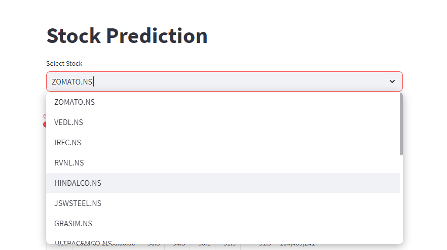
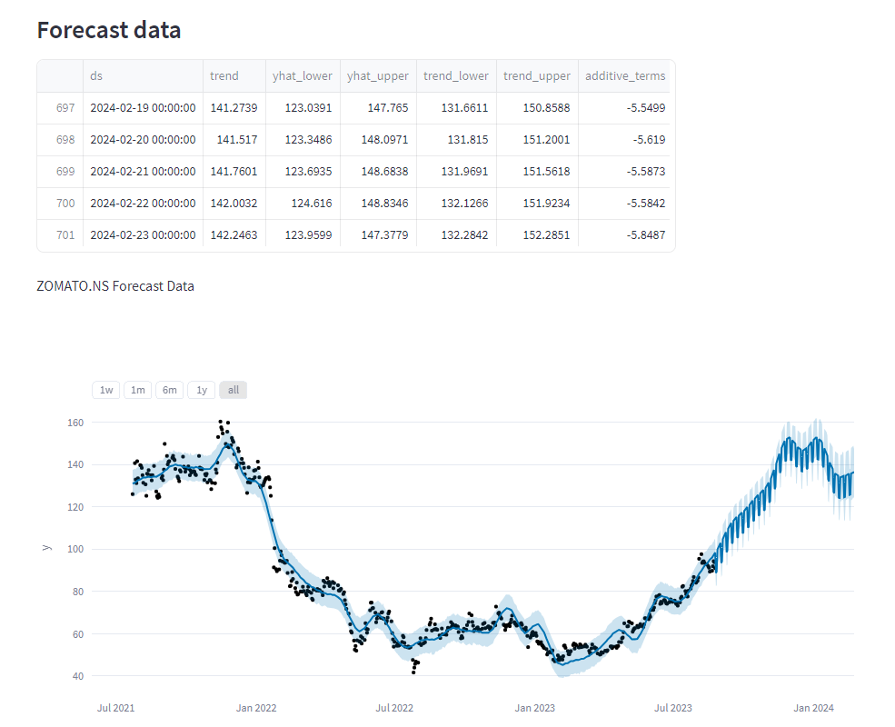

# Stock Forecasting with Streamlit



This Streamlit-based application allows users to predict and visualize future stock prices. Users can select a stock, choose a prediction period, and explore both historical and forecasted stock data through interactive charts.

## Table of Contents

- [Features](#features)
- [Getting Started](#getting-started)
  - [Prerequisites](#prerequisites)
  - [Installation](#installation)
- [Usage](#usage)
- [Contributing](#contributing)
- [License](#license)


## Features

- Choose from a selection of stocks for prediction.
- Adjust the prediction period using a slider.
- Visualize raw stock data with interactive line charts.
- Forecast future stock prices using the Prophet forecasting model.
- View forecasted data and components in interactive plots.

## Getting Started

### Prerequisites

- Python 3
- Streamlit
- yfinance
- Prophet

### Installation

1. Clone the repository:

   ```bash
   git clone https://github.com/sanjaykambi/Stocks_Forecast_App.git
   cd Stocks_Forecast_App
   ```

2. Install the required dependencies:

   ```bash
   pip install -r requirements.txt
   ```

## Usage

1. Run the Streamlit app:

   ```bash
   python -m streamlit run app.py
   ```

2. Select a stock from the dropdown menu.
3. Adjust the prediction period using the slider.
4. Explore the raw data, forecasted prices, and forecast components through interactive charts.

## Contributing

Contributions are welcome! If you encounter any issues or want to enhance the app, feel free to open a pull request.

## License

This project is licensed under the [MIT License](LICENSE).
